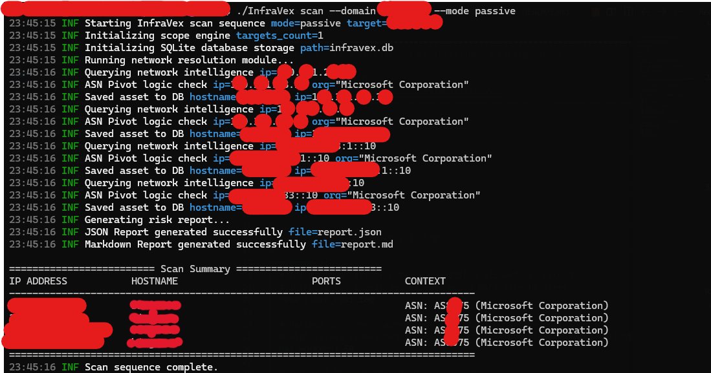

# InfraVex



**Infrastructure Intelligence & Attack Surface Mapping Framework**

*Designed for Authorized Security Assessments, Red/Purple Team Operations, and Targeted Bug Bounty Engagements.*

[](https://golang.org/dl/)
[](LICENSE)

---

## Overview

InfraVex is a highly concurrent, precision-focused infrastructure mapping engine authored by `@medjahdi`. It performs comprehensive reconnaissance and attack surface resolution through strict modularity, entirely bypassing blind internet-wide scanning methodologies.

The framework is engineered around:
* **Massive Concurrency:** Utilizes Go-native goroutines and semaphore-controlled worker pools to ensure rapid execution without OS-level memory exhaustion.
* **Legal-by-Design Execution:** Enforces strict boundary checks against predefined targets (domains and CIDR blocks) in memory.
* **CDN Evasion Logic:** Auto-detects reverse proxies and WAF infrastructure to prevent inaccurate edge-node fingerprinting.

## Core Capabilities

* **Passive Reconnaissance Mode:** Executes pure OSINT intelligence gathering including domain resolution (A/AAAA/CNAME), WHOIS lookups, and ASN extraction without establishing direct TCP handshakes with targets.
* **Active Scanning Mode:** Performs rapid parallel TCP sweeps for port discovery and basic fingerprinting. Integrated semaphores prevent resource starvation.
* **Automated CDN Bypass:** Identifies infrastructure belonging to Cloudflare, Akamai, Fastly, and AWS. Automatically halts active scanning against these nodes to prioritize origin discovery.
* **Extensible Target Ingestion:** Processes single domains via CLI arguments or parses bulk datasets through unified scope configuration files.
* **Persistent Local Storage:** Logs all discovered assets and relationships into a local SQLite tracking database.
* **Actionable Reporting:** Generates dynamic Markdown (`report.md`) and JSON (`report.json`) exports tailored for SIEM ingestion and assessment documentation.

---

## Architecture Flow

1. **Input & Validation:** Sanitizes arrays of domains, IP addresses, and CIDR ranges.
2. **Scope Enforcement:** Compiles a hard boundary map to drop any resolutions outside authorized parameters.
3. **Resolution Engine:** Executes concurrent dual-stack DNS queries.
4. **Network Intelligence:** Interrogates target IPs for Live ASN and Organization context, flagging CDN configurations.
5. **Active Operations:** Initiates governed, multi-threaded TCP fingerprinting (Optional; requires explicit CLI authorization).
6. **Reporting Engine:** Correlates intelligence fragments into localized structural graphs and tabular formats.

## Installation

Ensure **Go 1.22+** is installed on your system.

```bash
git clone https://github.com/medjahdi/InfraVex.git
cd InfraVex
go mod tidy
go build -o InfraVex main.go
```

## Usage

### Global Arguments
```text
  -D, --domain string   Execute scan against a single target domain
  -S, --scope string    Path to scope definition file for bulk execution
  -M, --mode string     Operational mode: passive or active (default: "passive")
  -d, --debug           Enable verbose debug-level logging
```

### Execution Examples

**1. Standard Passive OSINT**
```bash
./InfraVex scan --domain target.com --mode passive
```

**2. Multi-Target Batch Processing**
Create a `targets.txt` file containing targets (domains, IPs):
```bash
./InfraVex scan --scope targets.txt --mode passive
```

**3. Active Penetration Sequence**
*Note: Active mode executes intentional TCP handshakes against targets and demands explicit `YES` confirmation at runtime. Infrastructure protected by known CDNs will be automatically bypassed.*
```bash
./InfraVex scan --scope targets.txt --mode active
```

---

## Configuration Tuning

Operational performance profiling is governed by `config.yaml` located in the root directory:

```yaml
performance:
  max_workers: 50         # Goroutine concurrency cap for TCP dials
  timeout_seconds: 5      # Network connection timeout thresholds
  rate_limit_rps: 100     # Internal pacing

scope:
  strict_enforcement: true
  max_cidr_expansion: 22

scanning:
  top_ports:
    - 80
    - 443
    - 8080
    - 8443
```

---

## Legal & Compliance Disclaimer

**This software is distributed strictly for authorized penetration testing and defensive posture assessment.** 
The author (`@medjahdi`) accepts zero liability for misuse, unauthorized infrastructure profiling, or operational damages resulting from the execution of active scanning modules against systems for which the operator lacks explicit, written authorization. 

Execution of the `--mode active` parameter assigns full operational and legal liability for the generated network traffic directly to the user.
